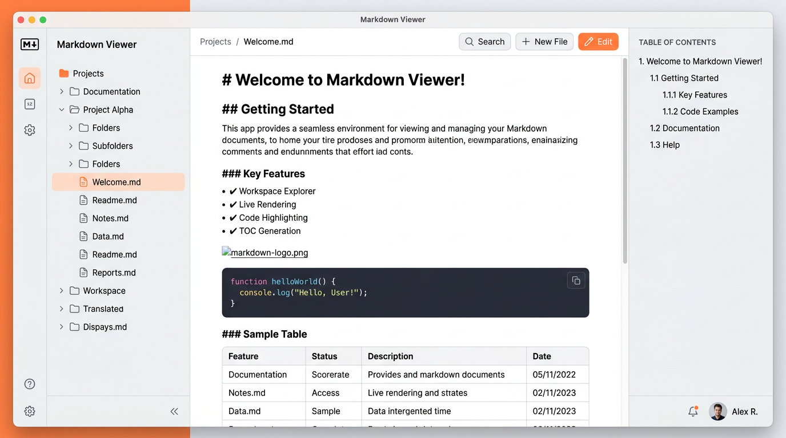

# Opsly MD

[](LICENSE)

Local-first Markdown workspaces in your browser. Paste or upload markdown files, organize them in workspaces and folders, and view with rich rendering—math, diagrams, syntax highlighting, and more. No account, no server, no tracking. Paste or upload markdown files, organize them in workspaces and folders, and view with rich rendering—math, diagrams, syntax highlighting, and more. No account, no server, no tracking.

**[→ Try it live](https://md.opsly.dev)** · [Report bug](https://github.com/iaminci/markdown/issues) · [Request feature](https://github.com/iaminci/markdown/issues)



## Features

- **Paste or upload** markdown files in the browser
- **Workspaces** – create multiple workspaces, switch between them
- **Folders** – nested folder hierarchy to organize documents
- **Drag and drop** – move documents between workspaces and folders
- **Table of contents** – auto-generated from headings
- **Syntax highlighting** – for code blocks (highlight.js)
- **Math** – LaTeX/KaTeX support
- **Mermaid diagrams** – flowcharts, sequence diagrams, etc.
- **Dark/light theme** toggle
- **Copy code** button on code blocks
- **Search** across documents (cmdk)
- **Save to file** – download documents as .md files
- **Import/Export** – export workspaces (single or multiple) to JSON; import to restore or migrate

## Quick Start

**Prerequisites:** Node.js >= 20.9.0, [pnpm](https://pnpm.io/)

```bash
# Clone the repository
git clone https://github.com/iaminci/markdown.git
cd markdown

pnpm install
pnpm dev
```

Open [http://localhost:3000](http://localhost:3000).

## Deploy to Vercel

1. Push this repo to GitHub
2. Import the project at [vercel.com/new](https://vercel.com/new)
3. Deploy (no build config needed)

Or use the Vercel CLI:

```bash
pnpm add -g vercel
vercel
```

## Tech Stack

- **Next.js 16** (App Router)
- **Tailwind CSS**
- **react-markdown** with remark-gfm, remark-math, rehype-katex, rehype-highlight, rehype-raw
- **Mermaid** for diagrams
- **KaTeX** for math
- **sql.js** – SQLite compiled to WebAssembly for in-browser storage
- **IndexedDB** (via idb) – persists the SQLite database blob

Data is stored in a SQLite database (documents, workspaces, folders tables) kept in IndexedDB. No server or backend required.

## Data & Privacy

Documents are stored locally in the browser. They persist only on the device where they were created and are not synced across devices. Documents previously stored in localStorage are automatically migrated to the SQLite/IndexedDB backend on first load.

Use **Export** to back up workspaces as JSON, and **Import** to restore them on another device or browser.

## Contributing

Contributions are welcome! Please feel free to submit a [Pull Request](https://github.com/iaminci/markdown/pulls). For larger changes, consider opening an [Issue](https://github.com/iaminci/markdown/issues) first to discuss.

## License

This project is licensed under the MIT License. See [LICENSE](LICENSE) for details.
